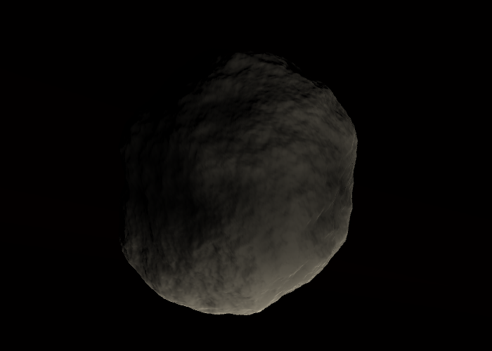
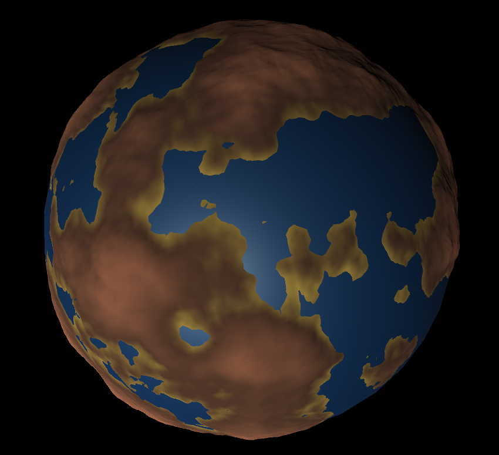

# PlanetGeneration
Procedural generation of planets (or asteroids, etc.) using Unity.

*Note: This repository is missing the default material for the planet.*

## Techniques used:
* 3D fBm using 3D Perlin noise
* Procedural sphere generation from cube normalization for trivial UV mapping
* Vertex displacement using the 3D fBm
* Numerical computation of vertex position's derivates to compute vertex normals
* Multithreaded generation

## Screenshots:

* Asteroid (25/02/2016):

* Earth-like Planet (26/02/2016):

