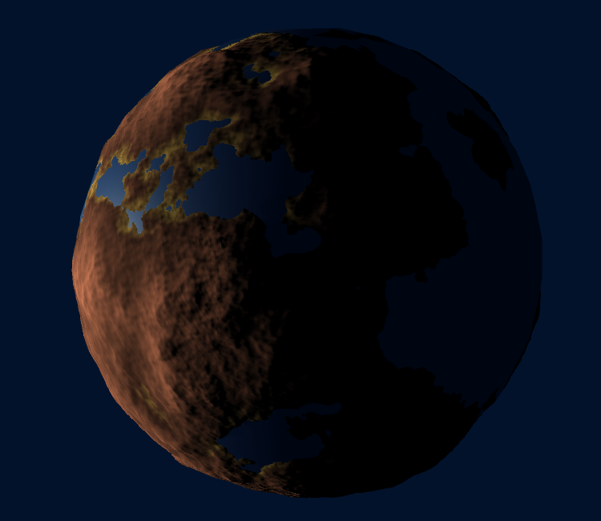

# PlanetGeneration
Procedural generation of planets (or asteroids, etc.) using Unity.

## Techniques used:
* 3D fBm using 3D Perlin noise
* Procedural sphere generation from cube normalization for trivial UV mapping
* Vertex displacement using the 3D fBm
* Numerical computation of vertex position's derivates to compute vertex normals
* Multithreaded mesh generation with dynamic LOD using quadtrees
* GPU-based planet texturing using Unity's surface shaders

## Screenshots:

* Asteroid (25/02/2016):

* Earth-like Planet (27/02/2016):

* First-person view (29/02/2016):

* Realistic textures (03/03/2016):

* Aerial view (03/03/2016):

